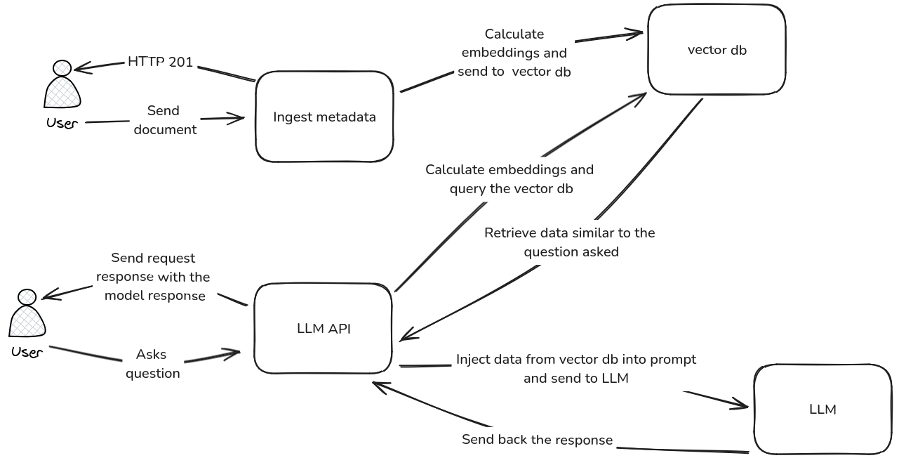

# Desafio técnico Hotmart

## Objetivo

Construção de dois microsserviços:

1. O primeiro será responsável por receber um documento de texto extraído dessa página [aqui](https://hotmart.com/pt-br/blog/como-funciona-hotmart), fazer seu processamento e o armazenar em um Vector Database;
2. O segundo será uma API que, dado um texto de entrada no formato de pergunta, busca nesse knowledge base qual(is) trecho(s) corresponde(m) a esse contexto, e usa isso como entrada para uma LLM gerar uma resposta.

Alguns pontos para se ter em mente:
-   Você poderá usar modelos proprietários (API) e/ou open-source. Encorajamos fortemente o uso de modelos open source, mas se isso não for possível no seu caso, seja por uma restrição de tempo ou de recurso, sinta-se à vontade para utilizar tecnologias proprietárias, como a OpenAI por exemplo.
- Você deverá utilizar um Vector Database open-source. O ponto mais importante aqui é recuperar a informação mais relevante dada uma pergunta para montar a resposta com a LLM;
- Esperamos que as duas APIs e o VectorDB funcionem localmente via Docker compose;
- Lembre-se: queremos entender suas habilidades em trabalhar com modelos, tecnologias e aplicações que já existem;

## Desenvolvimento

### Arquitetura de solução

O diagrama abaixo demonstra uma visão macro da solução na qual existem dois fluxos possíveis, o primeiro no qual o usuário envia um arquivo para ter sua informação armazenada dentro do banco de dados vetorial. Já no segundo o usuário envia uma pergunta para a API, essa API antes de encaminhar a pergunta para o LLM, calcula os embeddings dessa pergunta e faz uma busca por similaridade no banco de dados vetorial, uma vez com esses dados em mãos, eles são injetados em um template juntamente com a pergunta do usuário e encaminhado para o modelo de LLM realizar a inferencia.



### Arquitetura de software

Visto que o cenário corporativo está em constante mudança, construir software preparado para se adaptar rapidamente pode ter um tempo de desenvolvimento inicial maior, porém, no longo prazo possuir abstrações e interfaces para os componentes cruciais, como o banco de dados vetorial, da mesma forma que a ferramenta de interação com o modelo de LLM se faz essencial para uma rápida troca e reaproveitamento de código.

Dessa forma, a arquitetura proposta tem por objetivo abstrair recursos os quais julguei que podem mudar com maior facilidade, como o banco de dados vetorial. Para o desafio optei por utilizar o [Qdrant](https://qdrant.tech/), porém, caso fosse um cenário real no qual se faz necessário alterar para o [ChromaDB](https://www.trychroma.com/), basta criar uma classe que implemente a interface base que todo o resto da aplicação irá funcionar da mesma forma.

## Para rodar a aplicação

Dentro do arquivo `docker-compose.yaml` é possível identificar que existem cinco serviços, são eles: `inference`, `ingestion`, `init_container`, `knowledge_base` e `ollama`. Os dois primeiros são os microsserviços citados na seção `Objetivo`, o `ollama` e o `knowledge_base` são os containers responsáveis pelo deploy do LLM e do banco de dados vetorial, respectivamente, já o `init_container` é um container efêmero o qual faz toda a configuração necessária para que os serviços estejam prontos para rodar.

Foi criado um volume no `init_container` que aponta para a pasta `/etc/site_sections`. Essa pasta contém os dados extraídos da página web, cada pergunta que existe na página foi extraída para um arquivo txt. Os arquivos que se iniciarem com a substring `default_` serão carregados no banco de dados vetorial pelo `init_container`. Pode-se observar que não são todos os arquivos que possuem esse prefixo.

Outra responsabilidade que o `init_container` possui é de fazer uma requsição http para o container do `ollama` de forma a preparar o modelo para receber requisições. Vale lembrar que, por mais que eu tenha optado por utilizar um modelo "leve" o [Qwen2.5 0.5B](https://huggingface.co/Qwen/Qwen2.5-0.5B), ele pode demorar alguns minutos para estar pronto para uso.

Sendo assim, como toda a responsabilidade para rodar a aplicação está no `init_container`, para rodar a aplicação, basta rodar o comando `docker compose up`.

## Como acessar o serviço

- `http://localhost:8000/docs` swagger do serviço de ingestão no banco de dados vetorial
- `http://localhost:8001/docs` swagger do serviço de inferencia do LLM

### Exemplos de requisição

`POST http://localhost:8000/uploadfile`

Faz o upload de um arquivo txt para ser ingerido no banco de dados vetorial

```
curl -X POST "http://localhost:8000/uploadfile" -F "file=@./etc/site_sections/{ESCOLHA_UM_ARQUIVO}"
```

Exemplo de resposta

```
{"detail":"ingestion successful"}
```

`POST http://localhost:8001/inference`

Realiza a inferencia utilizando o modelo de LLM a partir de uma pergunta enviada pelo usuário

```
curl -X POST http://localhost:8001/inference -H "Content-Type: application/json" -d '{"question": "o que é a hotmart?"}'
```
Exemplo de resposta
```
{"response":"A Hotmart é uma plataforma de distribuição e venda de produtos digitais. Ela oferece um modelo de negócio para criadores de conteúdo, produtores de conteúdo, afiliados, compradores e líderes de mercado em toda a América Latina. Ao se profundizar nas alternativas que o marketing digital oferece no empreendedorismo, a Hotmart é considerada uma plataforma completa para venda de conteúdos digitais."}
```


## Pontos de melhoria

- Além da arquitetura de RAG, utilizar um modelo com treinado com dados de interesse da companhia pode gerar respostas mais precisas;
- Muitos componentes se repetem nos microsserviços, dessa forma esse código repetido poderia ser abstraído para uma biblioteca interna e somente reaproveitado dentro dos serviços;
- O tamanho das imagens docker podem ser reduzidos utilizando versões `slim` ou `alpine`, ou ainda utilizando multistage build;
- Utilizar modelos com maior quantidade de parâmetros pode gerar respostas mais assertivas;
- O modelo para calcular os embeddings foi o próprio Qwen2.5 0.5B, talvez ele não seja o mais indicado para essa tarefa. Mas, foi o escolhido dado os recursos computacionais disponíveis e simplicidade de uso, visto que também é utilizado para a inferência.

